# Azure Cloud Fundamentals and Data Pipeline Implementation using Azure Data Factory

## 📌 Objective

The objective of this project is to understand Azure cloud fundamentals and implement a complete data pipeline using Azure Blob Storage and Azure Data Factory (ADF). The project covers resource provisioning, data storage, pipeline creation, metadata validation, pipeline execution, and access management using Azure IAM.

---

# 🛠️ Technologies Used

- Microsoft Azure
- Azure Resource Group
- Azure Storage Account
- Azure Blob Storage
- Azure Data Factory (ADF)
- Azure IAM (Role-Based Access Control)
- CSV Dataset

---

# 📂 Project Architecture

Blob Storage (CSV File)
↓
Azure Data Factory
↓
Get Metadata
↓
Copy Data
↓
Destination Blob Storage

---

# Assignment Tasks

## Task 1 – Create Resource Group

### Description

Created an Azure Resource Group to organize and manage all Azure resources required for the project.

### Screenshot

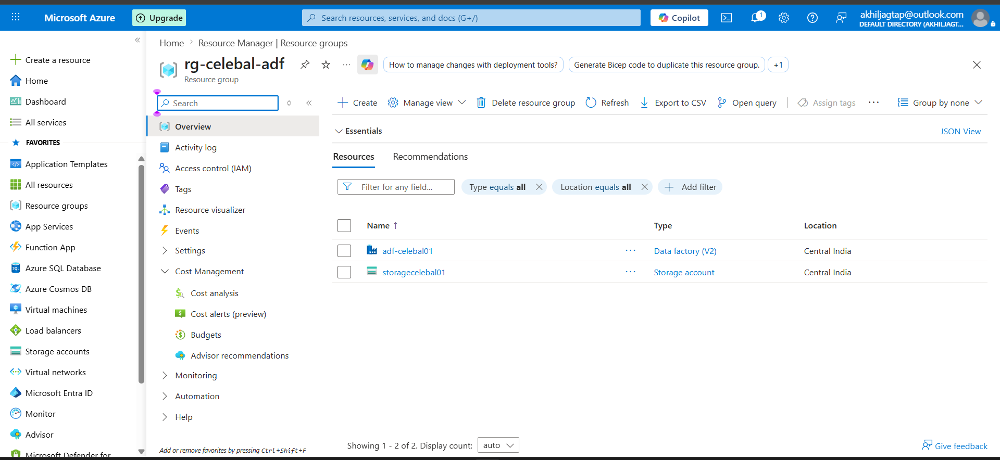

---

## Task 2 – Storage Setup

### Description

Created an Azure Storage Account, configured a Blob Container, and uploaded the source CSV file.

### Screenshot

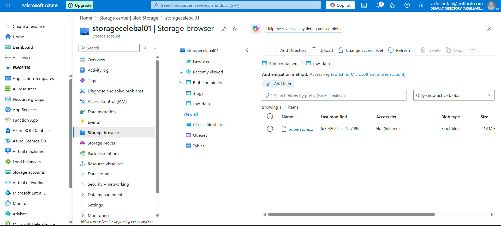

---

## Task 3 – Azure Data Factory Basics

### [a] Linked Service

Configured a Linked Service to establish a secure connection between Azure Data Factory and Azure Blob Storage.

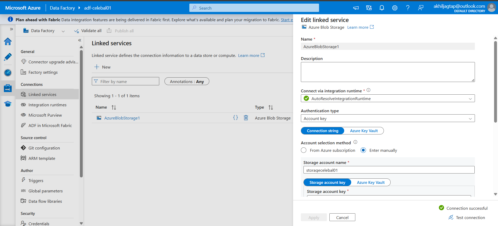

### Dataset

Created source and destination datasets representing the input and output CSV files used by the pipeline.

#### [bI] Input Dataset

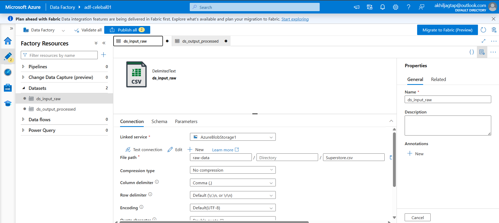

#### [bII] Output Dataset

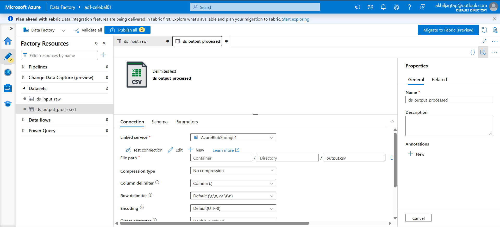

### [C] Get Metadata

Configured the Get Metadata activity to validate the source file by retrieving metadata such as file existence, file size, and last modified date before processing.

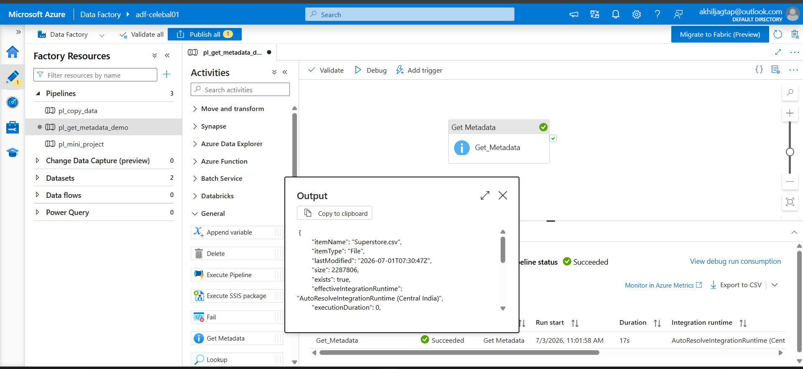

---

## Task 4 – Pipeline Development

### Description

Designed an Azure Data Factory pipeline using the Copy Data activity to transfer data from the source Blob Storage to the destination location.

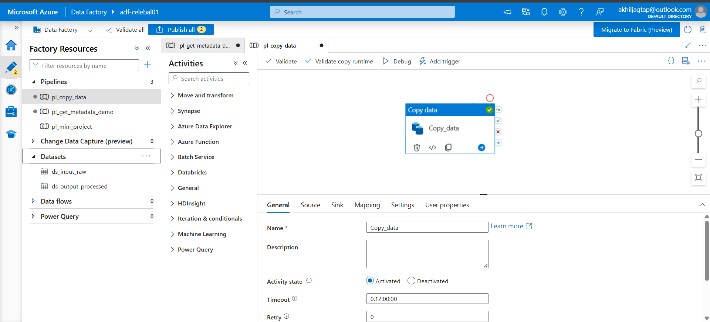

---

## Task 5 – Pipeline Execution

### Description

Executed the pipeline using Debug and verified that the pipeline completed successfully.

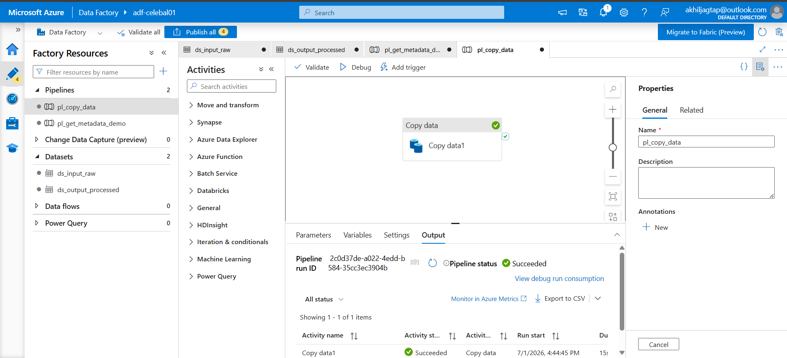

---

## Task 6 – IAM Role Assignment

### Description

Assigned Reader and Contributor roles to the Azure Data Factory Managed Identity, allowing secure access to Azure Storage without using storage keys.

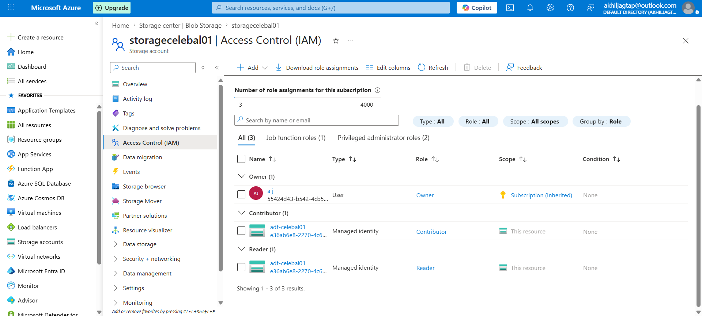

---

# Mini Project

## Problem Statement

Build a complete Azure Data Factory pipeline that reads a CSV file from Azure Blob Storage, validates its metadata, and copies it to another location.

### [a] Pipeline Execution

Successfully executed the pipeline.

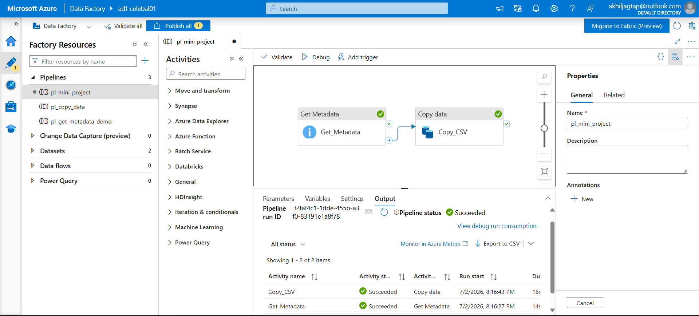

### [b] Output File

Verified that the CSV file was successfully copied to the destination.

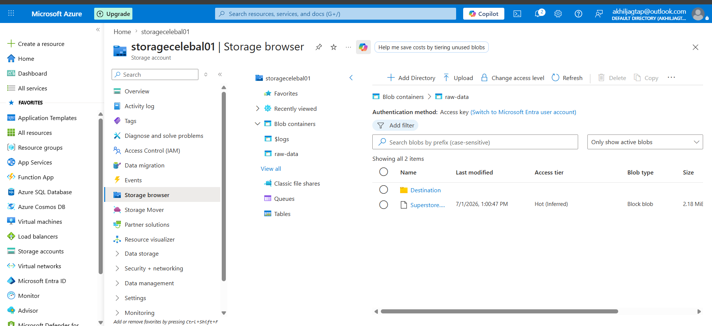

### [c] Metadata Validation

Validated the source file using the Get Metadata activity before copying.

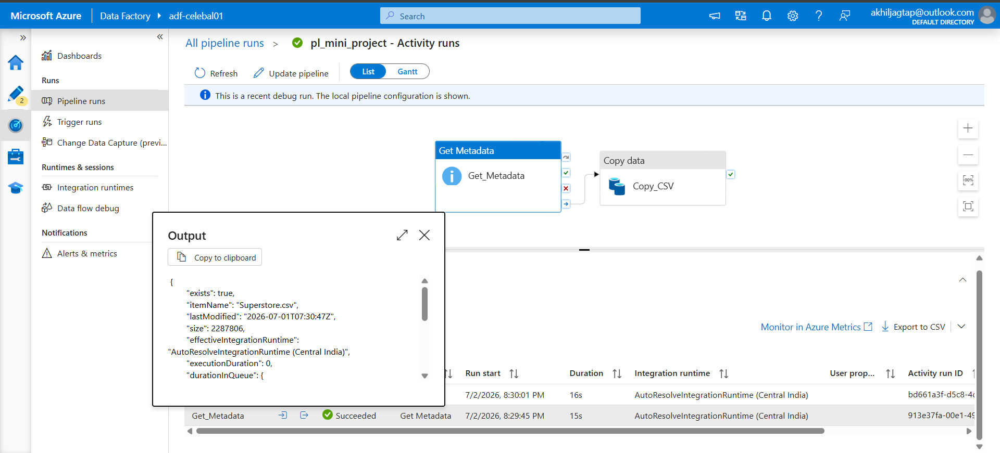

---

# Learning Outcomes

Through this project, I learned:

- Azure Resource Group management
- Azure Storage Account and Blob Storage
- Azure Data Factory fundamentals
- Linked Services and Datasets
- Get Metadata activity
- Copy Data activity
- Pipeline development and execution
- Azure IAM role assignment
- End-to-end data pipeline implementation

---

# Author

**Akhil Jagtap**
